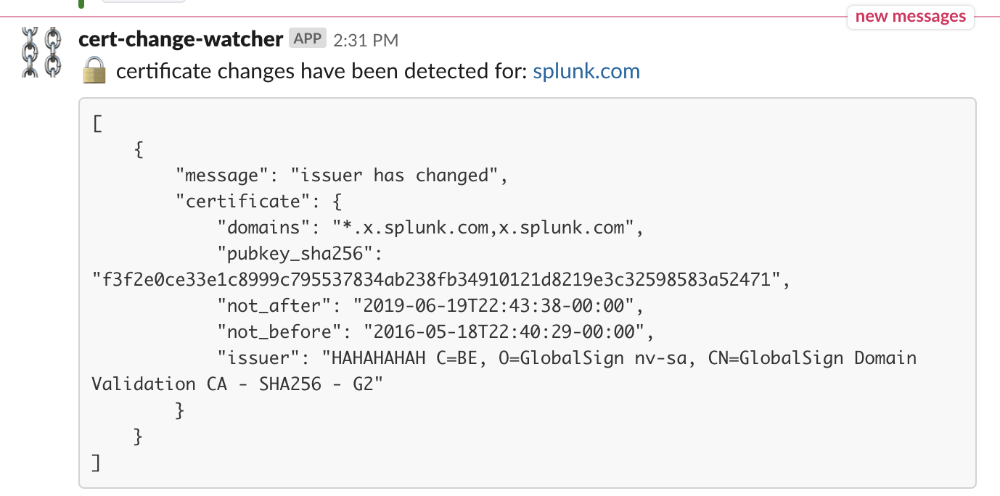

# cert-change-watcher
Sends a slack alert when it sees changes in your certificates and save the change locally.

* new or removed domains
* changes in issuers
* new certificates for subdomains



----
# Installation
1. Get a API key from: https://sslmate.com/certspotter/
2. `git clone https://github.com/d1vious/cert-change-watcher.git`
3. `cd cert-change-watcher && virtualenv venv -p python3 && source venv/bin/activate && pip install -r requirements.txt`

## Usage

```
usage: cert-change-watcher.py [-h] -k APITOKEN [-s SLACKHOOK] -d DOMAINS
                              [-o OUTPUT]

monitors certificate changes using cert spotter api and alerts to slack

optional arguments:
  -h, --help            show this help message and exit
  -k APITOKEN, --apitoken APITOKEN
                        api token for cert spotter, example 1234_adfdafasfdas
  -s SLACKHOOK, --slackhook SLACKHOOK
                        slack web hook to notify of changes
  -d DOMAINS, --domains DOMAINS
                        command delimited list of domains to monitor changes
                        for, example "splunk.com,elastic.com"
  -o OUTPUT, --output OUTPUT
                        outputs results in JSON to a localfile, defaults to
                        results.json

In order to use this tool you will need an API key from certspotter, and also
provide the slack API web hook.
```

## Examples

#### First run
```
── # python cert-change-watcher.py -k $CERTSPOTTER_TOKEN -d splunk.com
## seems this is our first run .. certspotter state file not present ##
## creating one at .certspotter.json ##
── # python cert-change-watcher.py -k $CERTSPOTTER_TOKEN -d splunk.com
## no changes ##
```

#### When a domain changes
```
── # python cert-change-watcher.py -k $CERTSPOTTER_TOKEN -d splunk.com
## domain splunk.com has changes: ##
{
    "message": "issuer has changed",
    "certificate": {
        "domains": "*.x.splunk.com,x.splunk.com",
        "pubkey_sha256": "f3f2e0ce33e1c8999c795537834ab238fb34910121d8219e3c32598583a52471",
        "not_after": "2019-06-19T22:43:38-00:00",
        "not_before": "2016-05-18T22:40:29-00:00",
        "issuer": "HAHAHAHAH C=BE, O=GlobalSign nv-sa, CN=GlobalSign Domain Validation CA - SHA256 - G2"
    }
}
## updating state .certspotter.json ##
```

#### When multiple domains change

```
── # python cert-change-watcher.py -k $CERTSPOTTER_TOKEN -d "splunk.com,elastic.com"
## domain splunk.com has changes: ##
{
    "message": "issuer has changed",
    "certificate": {
        "domains": "*.x.splunk.com,x.splunk.com",
        "pubkey_sha256": "f3f2e0ce33e1c8999c795537834ab238fb34910121d8219e3c32598583a52471",
        "not_after": "2019-06-19T22:43:38-00:00",
        "not_before": "2016-05-18T22:40:29-00:00",
        "issuer": "HAHAHAHAH C=BE, O=GlobalSign nv-sa, CN=GlobalSign Domain Validation CA - SHA256 - G2"
    }
}
## domain elastic.com has changes: ##
{
    "message": "domains have changed",
    "certificate": {
        "domains": "shoes.com,elastic.com,www.elastic.com",
        "pubkey_sha256": "6a9f8e6f1c872dfe52a6789b1f86c397842673034b0a30fa20e170596cab57a5",
        "not_after": "2019-11-20T15:52:09-00:00",
        "not_before": "2016-11-01T13:44:39-00:00",
        "issuer": "C=US, ST=Arizona, L=Scottsdale, O=\"GoDaddy.com, Inc.\", OU=http://certs.godaddy.com/repository/, CN=Go Daddy Secure Certificate Authority - G2"
    }
}
## updating state .certspotter.json ##
```

#### Send a slack alert with a change
```
python cert-change-watcher.py -k $CERTSPOTTER_TOKEN -d "splunk.com,elastic.com" -s https://hooks.slack.com/services/xxx/xxxx
```
#### Example generated of JSON output `cat results.json | jq`

```
{
  "timestamp": "2019-06-12T13:52:22.425827",
  "changes": [
    {
      "id": "962016867",
      "tbs_sha256": "br723a77a80949193f8e8cfc17ab5c30a4e634390e3d3947f3bbff17692aada9",
      "dns_names": [
        "*.lmao.splunkcloud.com",
        "lmao.splunkcloud.com"
      ],
      "pubkey_sha256": "bw3e4db04e463857da56fa816d46900b8950d17e4fe0ed1fc961655fa079f07a",
      "issuer": {
        "name": "C=US, O=DigiCert Inc, CN=DigiCert SHA2 Secure Server CA",
        "pubkey_sha256": "e6425f344330d0a8eb080bbb7976391d976fc824b5dc16c0d15246d5148ff75c"
      },
      "not_before": "2019-06-11T00:00:00-00:00",
      "not_after": "2020-06-15T12:00:00-00:00"
    },
    {
      "id": "963468680",
      "tbs_sha256": "720c53fe88fcd324b16396341c92689efb59a9cac90f26a40cf57a76c37348c3",
      "dns_names": [
        "*.old.splunkcloud.com",
        "old.splunkcloud.com",
        "*.es-road.splunkcloud.com",
        "es-road.splunkcloud.com"
      ],
      "pubkey_sha256": "e0b33306448cd8b1aaeb313d2ed372a390db2453b5504t50018cce962293d893",
      "issuer": {
        "name": "C=US, O=DigiCert Inc, CN=DigiCert SHA2 Secure Server CA",
        "pubkey_sha256": "e6426f344330d0a8eb080bbb7976391d976fc814b5dc16c0d15246d5148ff75c"
      },
      "not_before": "2019-06-12T00:00:00-00:00",
      "not_after": "2020-06-16T12:00:00-00:00"
    }
  ],
  "domain": "splunkcloud.com"
}
```